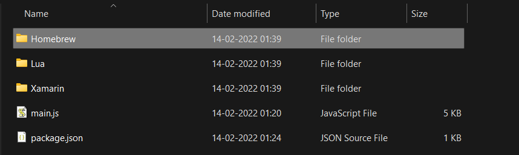

# GitHub Web Scraper
It is used to collect information about github repository issues link on different topics 
from github.com/topics page.
Three topic are selected from github topic page and in each topic top 10 repository are selected,
it create one folder for every topic and create pdf file for different repository with their repo issue link and small description about issues.

* command: `node main.js`

For Example: 

* Three folders are created for three different topics.

* Top 10 Repository issues is collected in pdf format

* Sample of information

